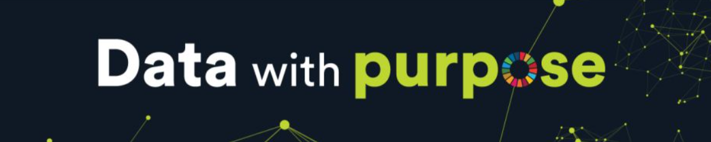

# 💫 About Me
🔭 I'm currently working in my master on: Building scalable Machine Learning and Data Engineering solutions. 🤝 I'm looking to collaborate on: Open-source projects related to ML Engineering, MLOps, and Big Data. 🌱 I'm currently learning: Reinforcement Learning, Text Mining, and Cloud-based MLOps strategies. 💬 Ask me about: Data Science and ML Engineering. ⚡ Fun fact: I won the 44th edition of the Global Management Challenge, competing against 480 teams!  

---

# 📂 **My Main Repositories**  

🔹 **Machine Learning & Data Science**  
- 📊 [**Machine Learning Projects**](https://github.com/jorgemiguelcordeiro/Machine-Learning-Projects) 
- 🤖 [**ML_Interface**](https://github.com/jorgemiguelcordeiro/ML_Interface) 
- 📈 [**Statistics for Data Science**](https://github.com/jorgemiguelcordeiro/Statistics-for-Data-Science)
- 🐍 [**OOP and General Programming**](https://github.com/jorgemiguelcordeiro/OOP-and-General-Programming)
- ⚙️ [**Machine Learning Operations (MLOps)**](https://github.com/jorgemiguelcordeiro/Machine-Learning-Operations-MLOps-/tree/main)
- 🤖 [**Reinforcement Learning**](https://github.com/jorgemiguelcordeiro/Reinforcement_Learning)

🔹 **SQL & Data Engineering**  
- 🗃️ [**SQL_project _Storing_and_Retrieving_Data**](https://github.com/jorgemiguelcordeiro/SQL-project-Storing-and-Retrieving-Data-)
- 📊 [**Big Data**](https://github.com/jorgemiguelcordeiro/Big_data)

🔹 **Data Mining & NLP**  
- ⛏️ [**Data Mining**](https://github.com/jorgemiguelcordeiro/Data-Mining)
- 🔤 [**Text Mining & NLP**](https://github.com/jorgemiguelcordeiro/Text-Mining-NLP)
  
🔹 **LLMs & Recommendation Systems**  
- 🤖 [**LLMs**](https://github.com/jorgemiguelcordeiro/LLMs)
- 🤖 [**Recommendation Systems**](https://github.com/jorgemiguelcordeiro/Recommendation-Systems)
  
🔹 **Deep learning & Computer Vision** 
- 👀 [**Computer Vision**](https://github.com/jorgemiguelcordeiro/Computer-vision)
- 👀 [**Deep Learning**](https://github.com/jorgemiguelcordeiro/Deep-Learning)

🔹 **Evolutionary-Computation-and-Optimization**
- 🐍 [**Genetic Algorithms Project**](https://github.com/jorgemiguelcordeiro/Evolutionary-Computation-and-Optimization)

---

## 🌐 Socials

# 💻 Tech Stack
         
   

